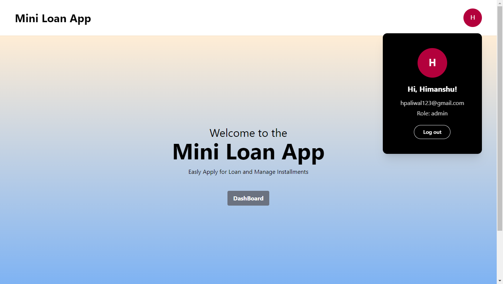
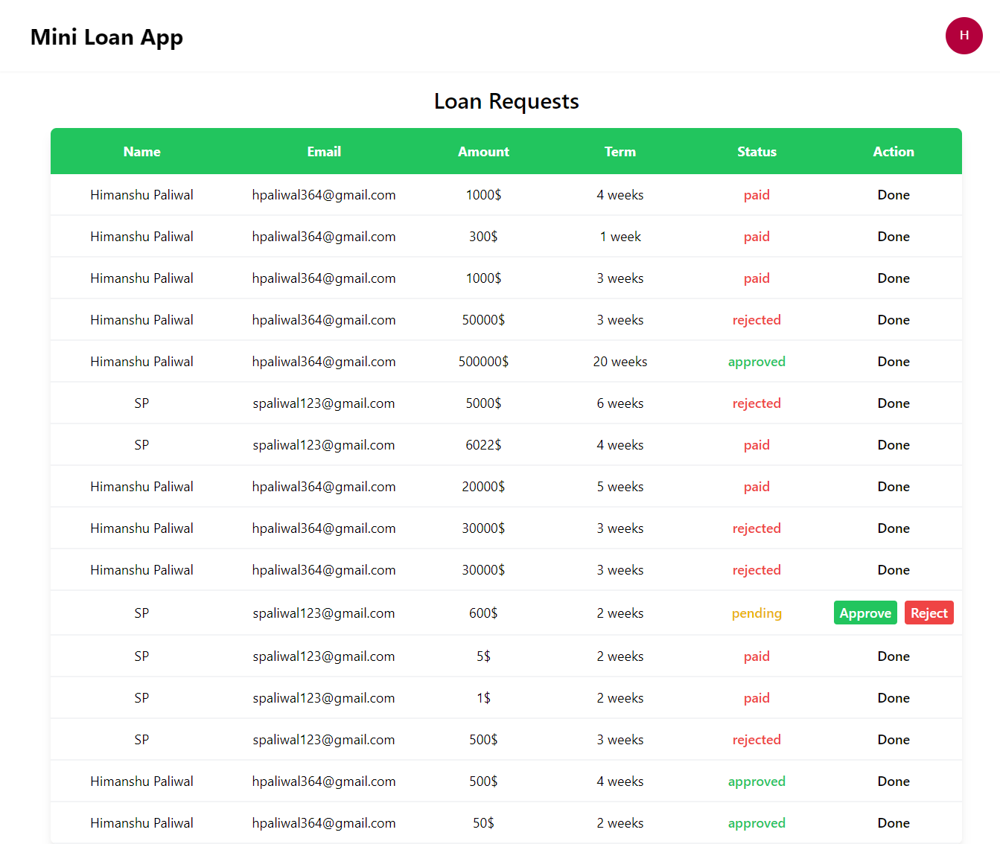
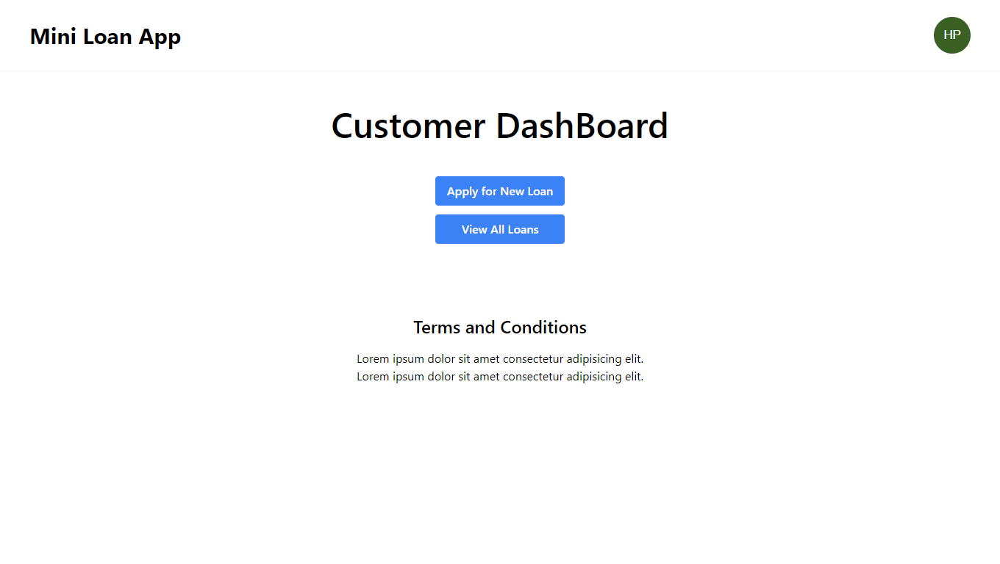
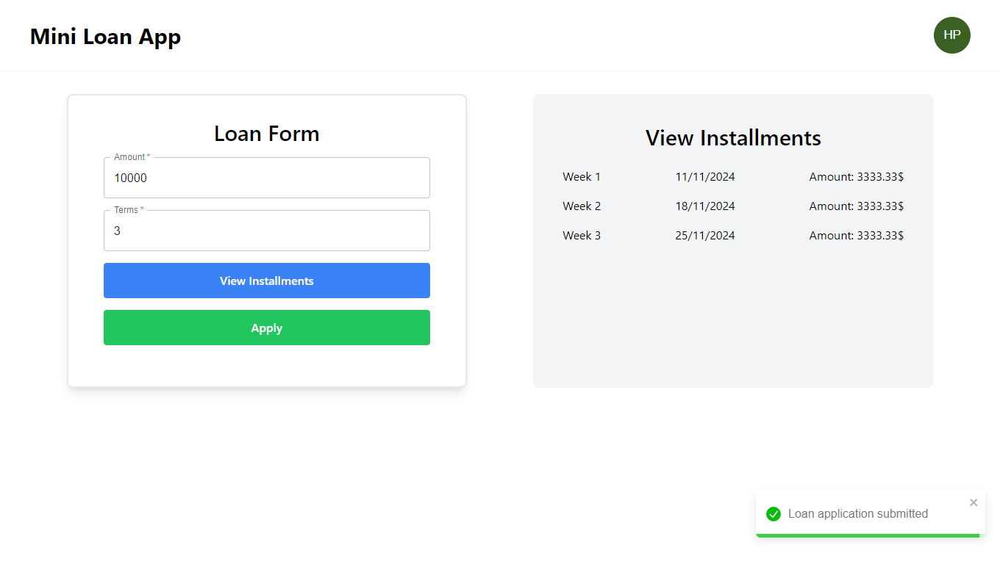
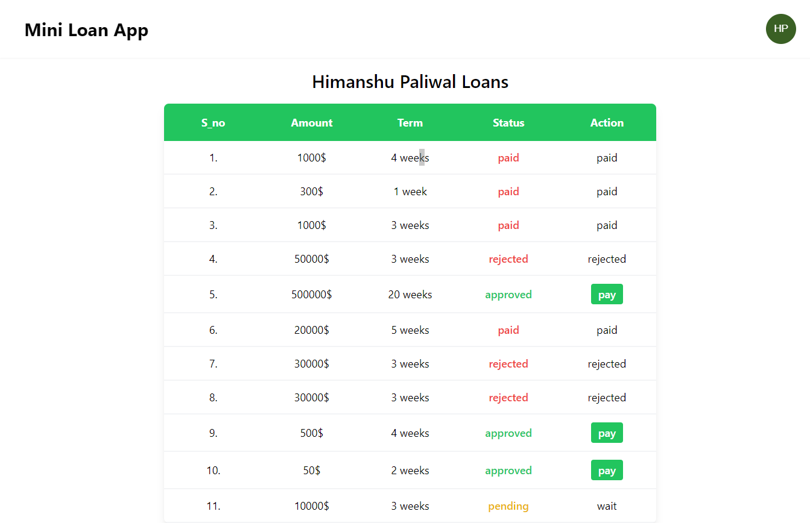
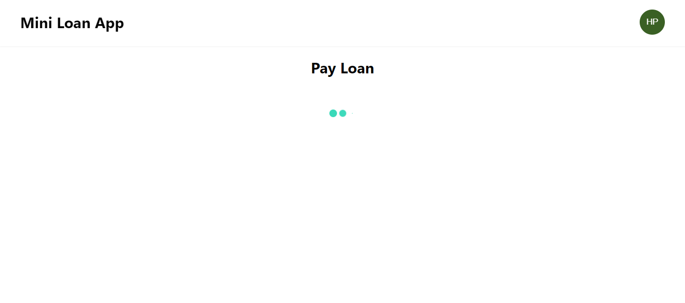
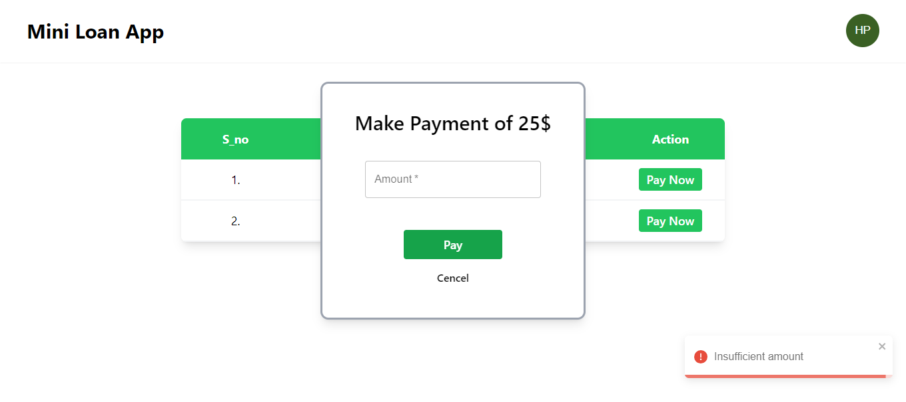
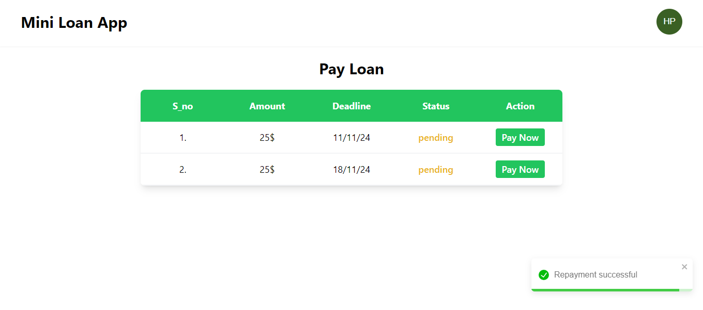
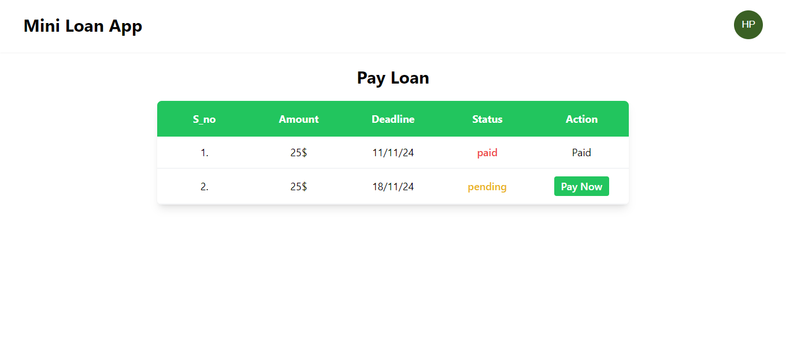

# Mini Loan Application

The **Mini Loan Application** is a full-stack MERN app that allows users to apply for loans, manage repayments, and track loan statuses. With separate roles for customers and admins, the app offers a tailored experience for each user, making it ideal for mini-loan management needs. The project is fully responsive, accessible on mobile and desktop devices.

## Features

- **User Authentication**: Secure login system for both customers and admins.
- **Loan Application**: Customers can request loans by specifying the amount and term.
- **Repayment Management**: Customers can make repayments toward their loans.
- **Loan Status Tracking**: View loan status, which update from "pending" to "paid" upon full repayment.
- **Admin Role**: Admins can log in to approve or reject loan applications, offering additional control over loan management.
- **Responsive Design**: Designed to be fully responsive for both mobile and desktop use.

## Technologies Used

- **Frontend**: React, Tailwind css, Material-UI (deployed on Netlify)
- **Backend**: Node.js, Express (deployed on Render)
- **Database**: MongoDB (hosted on MongoDB Atlas)

## Deployment Links

- **Live Project**: [Mini Loan Application](https://mini-loan-app-react.netlify.app) 
- **Backend API**: [API on Render](https://loan-app-backend-dz62.onrender.com) 

## Installation & Setup

1. **Clone the Repository**
   ```bash
   git clone https://github.com/himanshu-paliwal-277/Loan-App-Frontend
   ```

2. **Install Dependencies**
   ```bash
   cd Loan-App-Frontend
   npm install
   ```

3. **Environment Variables**
   - Create a `.env` file in the root directory.
   - Add necessary environment variables 

4. **Run the Application**
   ```bash
   npm run dev
   ```

## Screenshots

### Admin Dashboard



### Customer Dashboard







